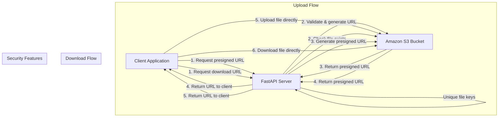
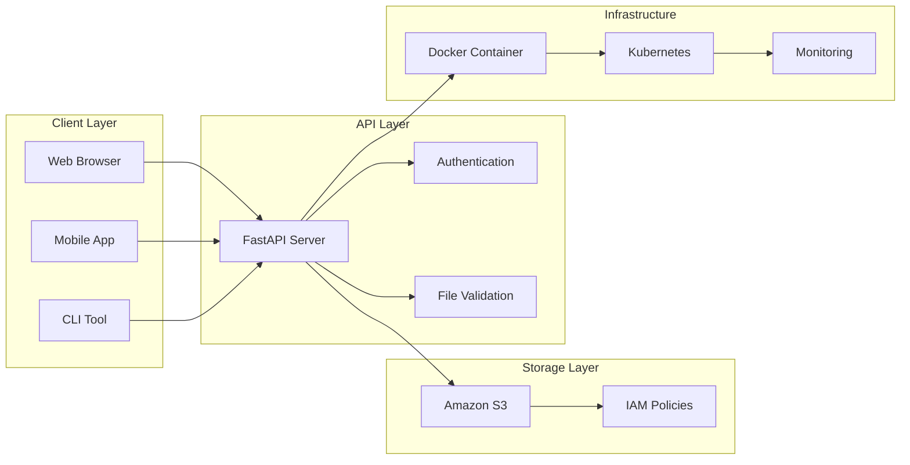

# S3 Presigned URL API

A FastAPI application that provides secure file upload and download functionality using Amazon S3 presigned URLs. This approach allows clients to upload and download files directly to/from S3 without exposing AWS credentials.

## Features

- Secure: No AWS credentials exposed to clients
- Temporary URLs: Configurable expiration times (default: 10 minutes)
- File Type Validation: Configurable allowed file types
- Direct S3 Access: Files uploaded/downloaded directly to/from S3
- File Management: List and delete files
- Health Checks: Monitor API and S3 connectivity
- CORS Enabled: Ready for frontend integration

## Architecture Overview



## How It Works

### Upload Workflow
1. Client requests a presigned upload URL from the API
2. API validates file type and generates a temporary S3 upload URL
3. Client uploads file directly to S3 using the presigned URL
4. No file data passes through the API server

### Download Workflow
1. Client requests a presigned download URL for a specific file
2. API verifies file exists and generates a temporary S3 download URL
3. Client downloads file directly from S3 using the presigned URL

### Key Benefits
- Direct S3 Transfer: Files never pass through your API server
- Secure: No AWS credentials exposed to clients
- Scalable: API server handles only metadata, not file data
- Cost Effective: Reduced bandwidth and server resources

## System Architecture



## Project Structure

```
├── app/
│   ├── __init__.py
│   ├── config.py          # Configuration settings
│   ├── models.py          # Pydantic models
│   └── s3_service.py      # S3 operations service
├── aws/
│   ├── iam_policy.json    # Required IAM permissions
│   └── bucket_cors_policy.json  # S3 bucket CORS configuration
├── examples/
│   ├── client_examples.py # Python client examples
│   └── frontend_example.html  # HTML/JavaScript frontend example
├── scripts/               # Automation scripts
│   ├── setup_aws.sh      # AWS resource setup
│   ├── deploy.sh         # Deployment automation
│   └── run_tests.sh      # Test automation
├── terraform/            # Infrastructure as Code
├── k8s/                  # Kubernetes manifests
├── monitoring/           # Prometheus & Grafana config
├── main.py              # FastAPI application
├── requirements.txt     # Python dependencies
├── .env.example        # Environment variables template
└── README.md
```

## Setup Instructions

### 1. Install Dependencies

```bash
pip install -r requirements.txt
```

### 2. AWS Configuration

#### Create S3 Bucket
```bash
aws s3 mb s3://your-bucket-name --region us-east-1
```

#### Configure Bucket CORS
```bash
aws s3api put-bucket-cors --bucket your-bucket-name --cors-configuration file://aws/bucket_cors_policy.json
```

#### Create IAM User and Policy
1. Create an IAM user for the application
2. Attach the policy from `aws/iam_policy.json` (replace `your-bucket-name` with your actual bucket name)
3. Generate access keys for the user

### 3. Environment Setup

Copy `.env.example` to `.env` and configure:

```bash
cp .env.example .env
```

Edit `.env`:
```env
AWS_ACCESS_KEY_ID=your_access_key_here
AWS_SECRET_ACCESS_KEY=your_secret_key_here
AWS_REGION=us-east-1
S3_BUCKET_NAME=your-bucket-name
PRESIGNED_URL_EXPIRATION=600
MAX_FILE_SIZE=52428800
```

### 4. Run the Application

```bash
uvicorn main:app --reload --host 0.0.0.0 --port 8000
```

The API will be available at:
- API: http://localhost:8000
- Documentation: http://localhost:8000/docs
- ReDoc: http://localhost:8000/redoc

## API Endpoints

### POST /upload-url
Generate a presigned URL for file upload.

Request:
```json
{
    "filename": "document.pdf",
    "content_type": "application/pdf"
}
```

Response:
```json
{
    "presigned_url": "https://s3.amazonaws.com/...",
    "expires_in": 600,
    "file_key": "uploads/uuid-document.pdf"
}
```

### POST /download-url
Generate a presigned URL for file download.

Request:
```json
{
    "file_key": "uploads/uuid-document.pdf"
}
```

Response:
```json
{
    "presigned_url": "https://s3.amazonaws.com/...",
    "expires_in": 600,
    "file_key": "uploads/uuid-document.pdf"
}
```

### GET /files
List files in the S3 bucket.

Response:
```json
{
    "files": [
        {
            "key": "uploads/uuid-document.pdf",
            "size": 1024,
            "last_modified": "2024-01-01T12:00:00",
            "etag": "abc123"
        }
    ],
    "count": 1
}
```

### DELETE /files/{file_key}
Delete a file from S3.

### GET /health
Health check endpoint.

## Usage Examples

### Python Client
```python
import requests

# Get upload URL
response = requests.post("http://localhost:8000/upload-url", json={
    "filename": "test.pdf",
    "content_type": "application/pdf"
})
upload_data = response.json()

# Upload file directly to S3
with open("test.pdf", "rb") as f:
    requests.put(upload_data["presigned_url"], data=f, headers={
        "Content-Type": "application/pdf"
    })
```

### JavaScript/Frontend
```javascript
// Get upload URL
const response = await fetch('/upload-url', {
    method: 'POST',
    headers: { 'Content-Type': 'application/json' },
    body: JSON.stringify({
        filename: file.name,
        content_type: file.type
    })
});

const { presigned_url } = await response.json();

// Upload file directly to S3
await fetch(presigned_url, {
    method: 'PUT',
    body: file,
    headers: { 'Content-Type': file.type }
});
```

## Configuration

### Allowed File Types
Configure in `app/config.py`:
```python
ALLOWED_FILE_TYPES = {
    '.jpg': 'image/jpeg',
    '.pdf': 'application/pdf',
    # Add more types as needed
}
```

### Security Considerations

1. CORS Configuration: Update CORS settings for production
2. File Size Limits: Configure `MAX_FILE_SIZE` appropriately
3. URL Expiration: Adjust `PRESIGNED_URL_EXPIRATION` based on needs
4. File Type Validation: Restrict allowed file types
5. Rate Limiting: Consider adding rate limiting for production
6. Authentication: Add user authentication for production use

## Testing

### Run Python Examples
```bash
python examples/client_examples.py
```

### Test with Frontend
Open `examples/frontend_example.html` in a browser and test the upload/download functionality.

### Health Check
```bash
curl http://localhost:8000/health
```

## Deployment Architecture

```mermaid
graph TB
    subgraph "Production Environment"
        LB[Load Balancer]
        
        subgraph "Application Tier"
            API1[FastAPI Instance 1]
            API2[FastAPI Instance 2]
            API3[FastAPI Instance 3]
        end
        
        subgraph "Storage Tier"
            S3[Amazon S3 Bucket]
            RDS[Database (Optional)]
        end
        
        subgraph "Monitoring Tier"
            Prometheus[Prometheus]
            Grafana[Grafana]
            Alerts[AlertManager]
        end
        
        subgraph "Security Tier"
            WAF[Web Application Firewall]
            IAM[IAM Roles & Policies]
            VPC[VPC & Security Groups]
        end
    end
    
    Internet --> WAF
    WAF --> LB
    LB --> API1
    LB --> API2
    LB --> API3
    
    API1 --> S3
    API2 --> S3
    API3 --> S3
    
    API1 --> RDS
    API2 --> RDS
    API3 --> RDS
    
    API1 --> Prometheus
    API2 --> Prometheus
    API3 --> Prometheus
    
    Prometheus --> Grafana
    Prometheus --> Alerts
    
    S3 --> IAM
    API1 --> IAM
    API2 --> IAM
    API3 --> IAM
```

## Production Deployment

### Deployment Options

1. **Docker**: Single container deployment
2. **Kubernetes**: Scalable container orchestration
3. **Terraform**: Complete infrastructure automation
4. **Manual**: Traditional server deployment

### Production Checklist

1. Use environment variables for all configuration
2. Enable HTTPS with SSL certificates
3. Configure proper CORS origins
4. Add authentication and authorization
5. Implement rate limiting
6. Add logging and monitoring
7. Use a production WSGI server like Gunicorn
8. Set up automated backups
9. Configure health checks
10. Implement monitoring and alerting

## Troubleshooting

### Common Issues

1. S3 Connection Failed: Check AWS credentials and region
2. CORS Errors: Verify bucket CORS configuration
3. File Upload Fails: Check file size limits and content type
4. Permission Denied: Verify IAM policy permissions

### Debug Mode
Set environment variable for detailed logging:
```bash
export FASTAPI_DEBUG=true
```

## License

MIT License - see LICENSE file for details.