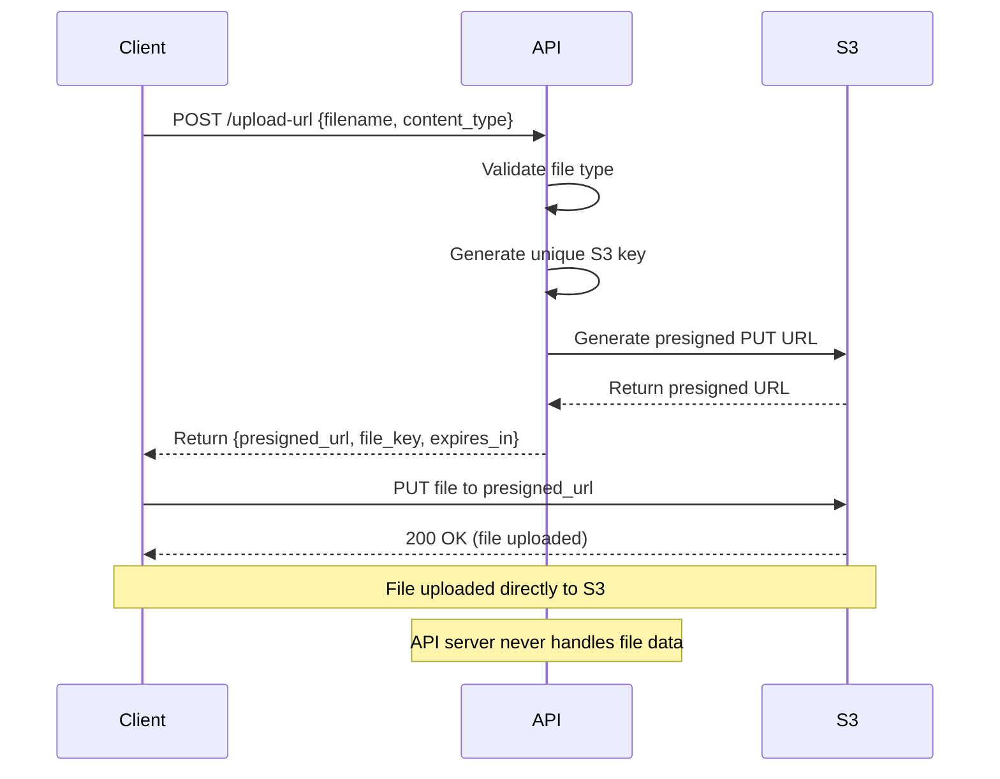
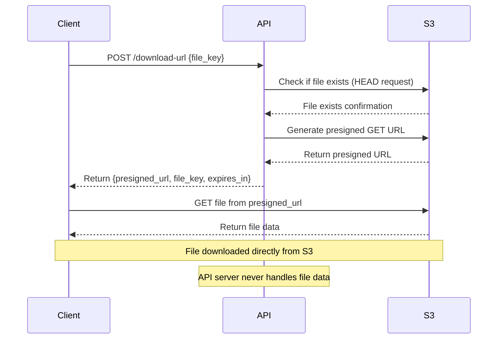

# S3 Presigned URL Workflow Explanation

## Overview

This FastAPI application implements a secure file upload/download system using Amazon S3 presigned URLs. The key advantage is that files are transferred directly between the client and S3, without passing through your API server, while maintaining security through temporary, signed URLs.

## How Presigned URLs Work

### What are Presigned URLs?
Presigned URLs are temporary URLs that grant time-limited access to S3 objects. They contain:
- The S3 object location
- AWS credentials embedded in the URL signature
- An expiration timestamp
- Specific permissions (GET, PUT, etc.)

### Security Benefits
1. No credential exposure: Clients never see your AWS access keys
2. Time-limited access: URLs expire after a set duration (default: 10 minutes)
3. Specific permissions: Each URL grants only the required operation (upload OR download)
4. Direct S3 access: No bandwidth usage on your API server

## Upload Workflow



### Step-by-Step Upload Process

1. Client Request: Client sends filename and content type to `/upload-url`
2. Validation: API validates the file type against allowed types
3. Key Generation: API generates a unique S3 key (e.g., `uploads/uuid-filename.pdf`)
4. Presigned URL: API requests a presigned PUT URL from S3
5. Response: API returns the presigned URL, file key, and expiration time
6. Upload: Client uploads file directly to S3 using the presigned URL
7. Completion: S3 confirms upload success to client

## Download Workflow



### Step-by-Step Download Process

1. Client Request: Client sends file key to `/download-url`
2. File Check: API verifies file exists in S3
3. Presigned URL: API requests a presigned GET URL from S3
4. Response: API returns the presigned URL and expiration time
5. Download: Client downloads file directly from S3 using the presigned URL

## File Management

### File Key Structure
- Pattern: `uploads/{uuid}-{original_filename}`
- Example: `uploads/123e4567-e89b-12d3-a456-426614174000-document.pdf`
- Benefits: 
  - Prevents filename conflicts
  - Maintains original filename for downloads
  - Organizes files in S3 bucket

### File Type Validation
```python
ALLOWED_FILE_TYPES = {
    '.jpg': 'image/jpeg',
    '.pdf': 'application/pdf',
    '.txt': 'text/plain',
    # ... more types
}
```

## Security Considerations

### 1. File Type Validation
- Only allowed file types can be uploaded
- Content-Type header is enforced
- File extensions are validated

### 2. Time-Limited Access
- URLs expire after 10 minutes (configurable)
- No permanent access to files
- Reduces risk of URL sharing

### 3. Unique File Keys
- UUID prevents guessing file names
- Organized storage structure
- Prevents accidental overwrites

### 4. CORS Configuration
- Properly configured for web browsers
- Allows direct S3 access from frontend
- Restricts origins in production

## Client Implementation Examples

### JavaScript (Frontend)
```javascript
// Upload
const response = await fetch('/upload-url', {
    method: 'POST',
    headers: { 'Content-Type': 'application/json' },
    body: JSON.stringify({
        filename: file.name,
        content_type: file.type
    })
});

const { presigned_url } = await response.json();

await fetch(presigned_url, {
    method: 'PUT',
    body: file,
    headers: { 'Content-Type': file.type }
});
```

### Python (Backend)
```python
import requests

# Get upload URL
response = requests.post('/upload-url', json={
    'filename': 'document.pdf',
    'content_type': 'application/pdf'
})

upload_data = response.json()

# Upload file
with open('document.pdf', 'rb') as f:
    requests.put(upload_data['presigned_url'], data=f)
```

## Error Handling

### Common Error Scenarios
1. **Invalid file type**: 400 Bad Request
2. **File not found**: 404 Not Found (download)
3. **S3 connection issues**: 503 Service Unavailable
4. **Expired URL**: 403 Forbidden (from S3)
5. **File too large**: 400 Bad Request

### Error Response Format
```json
{
    "detail": "File type .exe not allowed. Allowed types: ['.jpg', '.pdf', ...]"
}
```

## Performance Benefits

### 1. Reduced Server Load
- No file data passes through API server
- Lower bandwidth usage
- Better scalability

### 2. Faster Transfers
- Direct S3 connection
- No intermediate processing
- Parallel uploads possible

### 3. Cost Efficiency
- Reduced data transfer costs
- Lower server resource usage
- S3's global CDN benefits

## Monitoring and Logging

### Health Checks
- S3 connectivity monitoring
- Bucket access verification
- API endpoint health

### Metrics to Track
- Upload/download request rates
- File type distribution
- Error rates by type
- Average file sizes

## Production Considerations

### 1. Authentication
- Add user authentication
- Associate files with users
- Implement access controls

### 2. Rate Limiting
- Prevent abuse
- Limit requests per user
- Implement quotas

### 3. File Lifecycle
- Automatic cleanup of old files
- Archive policies
- Storage class transitions

### 4. Monitoring
- CloudWatch integration
- Error tracking
- Performance monitoring

This workflow provides a secure, scalable, and efficient way to handle file uploads and downloads while keeping your API server lightweight and your AWS credentials secure.